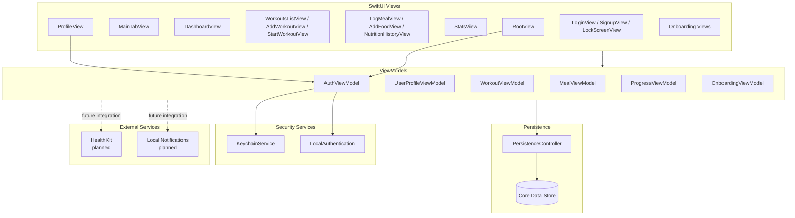

# FitFlow Component Diagram

This component view reflects the current codebase structure and clearly marks planned external integrations.

```mermaid
flowchart TB
    subgraph UI[SwiftUI Views]
        RV[RootView]
        TAB[MainTabView]
        DASH[DashboardView]
        WORK[WorkoutsListView / AddWorkoutView / StartWorkoutView]
        NUTR[LogMealView / AddFoodView / NutritionHistoryView]
        STATS[StatsView]
        PROF[ProfileView]
        AUTHV[LoginView / SignupView / LockScreenView]
        ONB[Onboarding Views]
    end

    subgraph VM[ViewModels]
        AVM[AuthViewModel]
        UPVM[UserProfileViewModel]
        WVM[WorkoutViewModel]
        MVM[MealViewModel]
        PVM[ProgressViewModel]
        OVM[OnboardingViewModel]
    end

    subgraph DATA[Persistence]
        PERSIST[PersistenceController]
        CD[(Core Data Store)]
    end

    subgraph SEC[Security Services]
        KC[KeychainService]
        LA[LocalAuthentication]
    end

    subgraph EXT[External Services]
        HK[HealthKit\nplanned]
        NOTI[Local Notifications\nplanned]
    end

    UI --> VM
    VM --> PERSIST
    PERSIST --> CD
    AVM --> KC
    AVM --> LA
    PROF --> AVM
    RV --> AVM
    VM -. future integration .-> HK
    VM -. future integration .-> NOTI
```

