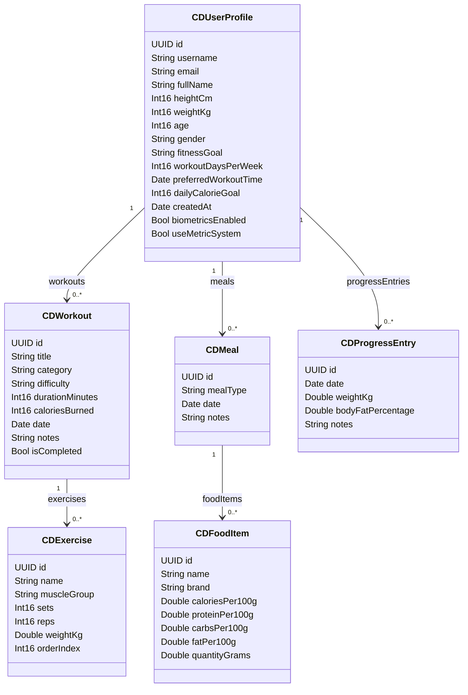

# FitFlow Data Design (ER/Class Diagram)

```mermaid
classDiagram
    class CDUserProfile {
      UUID id
      String username
      String email
      String fullName
      Int16 heightCm
      Int16 weightKg
      Int16 age
      String gender
      String fitnessGoal
      Int16 workoutDaysPerWeek
      Date preferredWorkoutTime
      Int16 dailyCalorieGoal
      Date createdAt
      Bool biometricsEnabled
      Bool useMetricSystem
    }

    class CDWorkout {
      UUID id
      String title
      String category
      String difficulty
      Int16 durationMinutes
      Int16 caloriesBurned
      Date date
      String notes
      Bool isCompleted
    }

    class CDExercise {
      UUID id
      String name
      String muscleGroup
      Int16 sets
      Int16 reps
      Double weightKg
      Int16 orderIndex
    }

    class CDMeal {
      UUID id
      String mealType
      Date date
      String notes
    }

    class CDFoodItem {
      UUID id
      String name
      String brand
      Double caloriesPer100g
      Double proteinPer100g
      Double carbsPer100g
      Double fatPer100g
      Double quantityGrams
    }

    class CDProgressEntry {
      UUID id
      Date date
      Double weightKg
      Double bodyFatPercentage
      String notes
    }

    CDUserProfile "1" --> "0..*" CDWorkout : workouts
    CDWorkout "1" --> "0..*" CDExercise : exercises
    CDUserProfile "1" --> "0..*" CDMeal : meals
    CDMeal "1" --> "0..*" CDFoodItem : foodItems
    CDUserProfile "1" --> "0..*" CDProgressEntry : progressEntries
```

