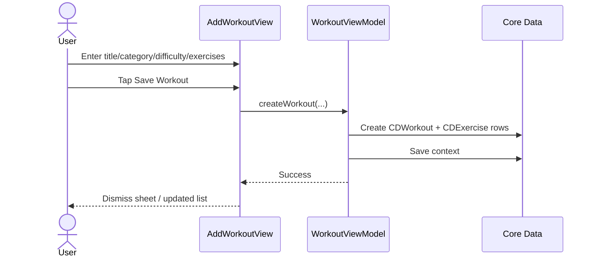
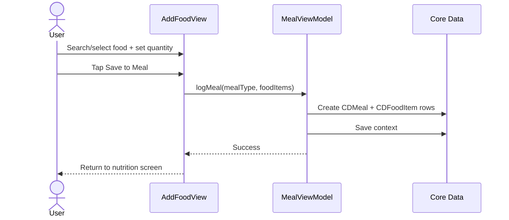
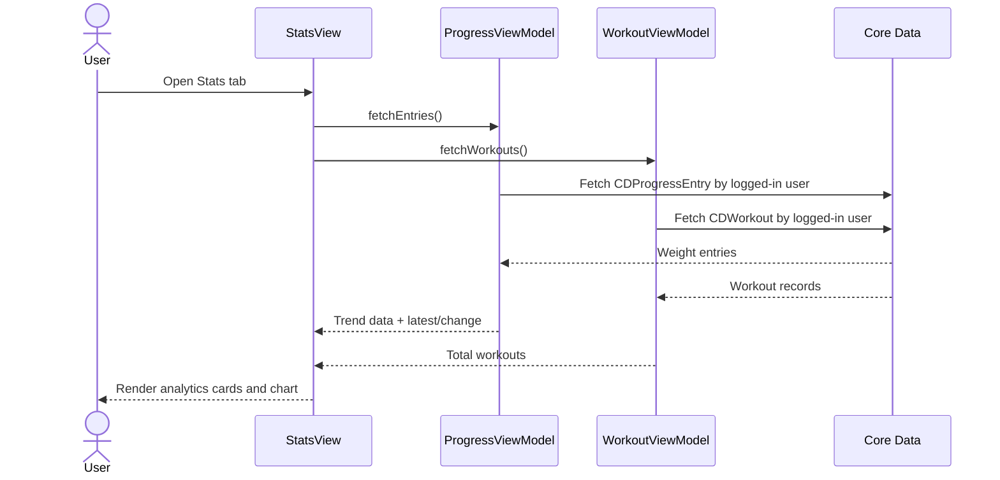

# FitFlow Functional Design (Sequence Diagrams)

## 1) Logging A Workout

```mermaid
sequenceDiagram
    actor User
    participant AW as AddWorkoutView
    participant WVM as WorkoutViewModel
    participant CD as Core Data

    User->>AW: Enter title/category/difficulty/exercises
    User->>AW: Tap Save Workout
    AW->>WVM: createWorkout(...)
    WVM->>CD: Create CDWorkout + CDExercise rows
    WVM->>CD: Save context
    WVM-->>AW: Success
    AW-->>User: Dismiss sheet / updated list
```

## 2) Logging A Meal

```mermaid
sequenceDiagram
    actor User
    participant AF as AddFoodView
    participant MVM as MealViewModel
    participant CD as Core Data

    User->>AF: Search/select food + set quantity
    User->>AF: Tap Save to Meal
    AF->>MVM: logMeal(mealType, foodItems)
    MVM->>CD: Create CDMeal + CDFoodItem rows
    MVM->>CD: Save context
    MVM-->>AF: Success
    AF-->>User: Return to nutrition screen
```

## 3) Viewing Progress

```mermaid
sequenceDiagram
    actor User
    participant SV as StatsView
    participant PVM as ProgressViewModel
    participant WVM as WorkoutViewModel
    participant CD as Core Data

    User->>SV: Open Stats tab
    SV->>PVM: fetchEntries()
    SV->>WVM: fetchWorkouts()
    PVM->>CD: Fetch CDProgressEntry by logged-in user
    WVM->>CD: Fetch CDWorkout by logged-in user
    CD-->>PVM: Weight entries
    CD-->>WVM: Workout records
    PVM-->>SV: Trend data + latest/change
    WVM-->>SV: Total workouts
    SV-->>User: Render analytics cards and chart
```

